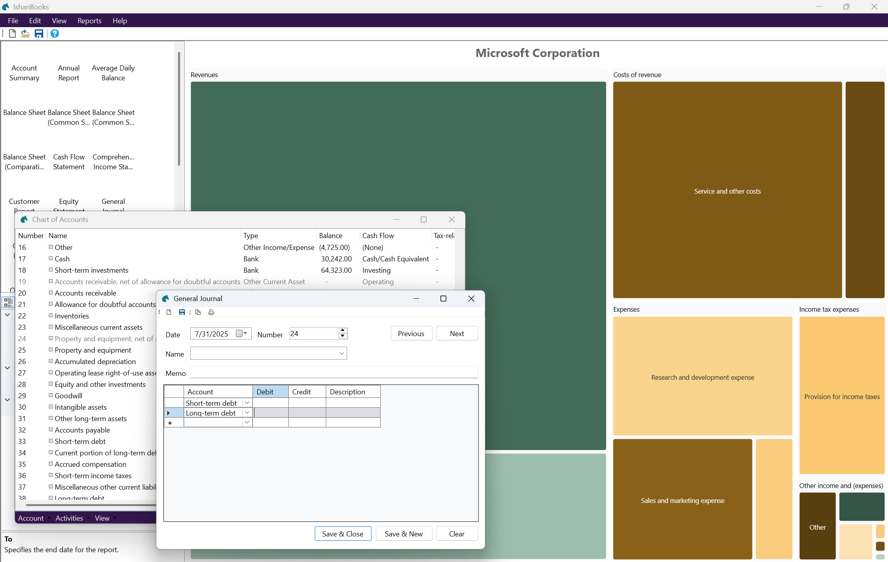

<!--
README.md
Copyright (c) 2023-2026 Ishan Pranav. All rights reserved.
Licensed under the MIT License.
-->

# IshanBooks

This is a cross-platform library and application for double-entry bookkeeping.
The project includes a standalone class library and a Windows GUI application.

You can download the software from the
[repository website](https://ishanpranav.github.io/ishan-books).

## Screenshots

, visual balance sheet, customized asset allocation chart, and new account form.")

## Features

__Bookkeeping and personal finance__
- [X] Chart of accounts
- [X] Make general journal entries
- [X] Write checks
- [ ] Use register
- [ ] Reconcile

__Reporting__
- [X] Trial balance
- [X] Income statement
- [X] Comprehensive income statement
- [X] Balance sheet
- [X] Comparative balance sheet
- [X] Cash flow statement
- [X] Equity statement
- [X] General journal
- [X] General ledger
- [X] Annual and quarterly reports
- [X] Income tax return reconciliation

__Visualizations__
- [X] Asset allocation
- [X] Income statement and cash flow Sankey diagrams
- [X] Time series

__Accounts receivable and accounts payable__
- [X] Generate invoice
- [X] Generate credit note

__First-class data formats__
- [X] IshanBooks Company (\*.izbk)
- [X] JavaScript Object Notation (\*.json)
- [X] SQLite3 Database (\*.db; \*.sqlite)

__Import-friendly formats__
- [X] Comma-delimited (\*.csv)
- [X] GnuCash Financial Data (\*.gnucash)

__Export-friendly formats__
- [X] Comma-delimited (\*.csv)
- [X] PDF Document (\*.pdf)
- [X] XPS Document (\*.xps)
- [X] HTML Document (\*.html)
- [ ] Intuit Interchange Format (\*.iif)
- [X] XML Document (\*.xml)

__Miscellaneous__
- [X] Password protection
- [X] Globalization and localization

## License

This repository is licensed with the [MIT](LICENSE.txt) license.

## Attribution

This software uses third-party libraries or other resources that may be
distributed under licenses different than the software. Please see the
third-party notices included [here](THIRD-PARTY-NOTICES.md).
